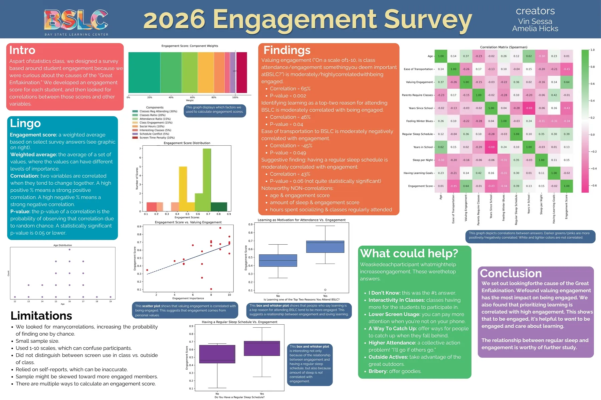

This year in Statistics class, Vin had a burning question he wanted to use statistics to answer: which variables (if any) predict the "engagement" levels of BSLC members?

Vin's research question led to some fascinating discussions. What is "engagement"? How could we measure engagement? And what variables do we suspect might be correlated with engagement levels?

After much discussion, we decided that "engagement" is multidimensional, and that we would create a survey designed to measure engagement and detect potential correlations with engagement. To measure the "engagment level" of a participant, we calculated a weighted average based on their answers to questions such as "How many BSLC classes do you attend regularly?"; "How many hours per week do you spend socializing at BSLC?"; and "How many hours per day do you spend on your phone while at BLSC?" We also asked questions such as "How many hours of sleep do you get per night?" to try to detect potential correlations with engagement levels. After we processed our data, we detected several statistically significant correlations (p &le; 0.05):

- How much a person *valued* engagement was the best predictor of how engaged they were.
- Identifying "learning" as a top reason for attending BSLC was moderately correlated with engagement.
- Ease of transportation to BSLC was moderately negatively correlated with engagement.

One of Vin's most interesting findings wasn't quite statistically signficant (p = 0.06): having a regular sleep schedule was moderately correlated with engagement. Even more interesting, there was no correlation between engagement and average number of hours slept per night--suggesting that regular sleep is more important than quantity of sleep.

Vin also found that engagement was *not* correlated with age, and that hours spent socializing was *not* correlated with number of classes regularly attended. Check out this summary of Vin's findings below!

<figure>
  
</figure>

<figure>
  <a href="../images/engagement-poster.pdf" target="_blank" style="display:inline-block; font-size:clamp(0.82rem,0.75rem + 0.25vw,1rem); font-weight:600; color:#1a8a8a; border-bottom:1px solid rgba(26,138,138,0.35); text-decoration:none;">View Vin's research poster (PDF)</a>
</figure>
